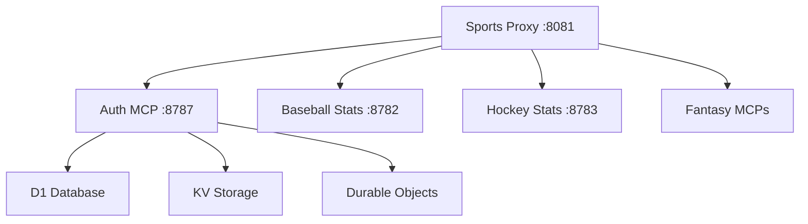

# Sports Platform Development Guide

Complete development setup, workflows, and contribution guidelines for Sports Platform v3.2.

## 🚀 Development Environment Setup

### Prerequisites

- **Node.js** 18+ with npm
- **Cloudflare CLI** (Wrangler)
- **Git** for version control
- **VS Code** (recommended) with extensions:
  - Cloudflare Workers
  - JavaScript/TypeScript
  - REST Client

### Installation

```bash
# Clone the repository
git clone https://github.com/your-org/sports-platform.git
cd sports-platform

# Install dependencies
npm install

# Install Cloudflare Wrangler globally
npm install -g wrangler

# Authenticate with Cloudflare
wrangler auth
```

## 🏗️ Development Architecture

### Local Development Stack

```
┌─────────────────────────────────────────────────────────────┐
│                    LOCAL DEVELOPMENT                       │
├─────────────────────────────────────────────────────────────┤
│  Terminal 1: Auth MCP        (localhost:8787)              │
│  Terminal 2: Hockey Stats    (localhost:8783)              │  
│  Terminal 3: Baseball Stats  (localhost:8782)              │
│  Terminal 4: Sports Proxy    (localhost:8081)              │
└─────────────────────────────────────────────────────────────┘
```

### Service Dependencies



## 🔧 Development Workflow

### 1. Start Development Servers

Use the provided script for easy startup:

```bash
# Start all services in the correct order
./start-dev-servers.sh

# Or manually start each service:

# Terminal 1 - Auth MCP (start first - required by others)
cd workers/auth-mcp
wrangler dev --port 8787 --local

# Terminal 2 - Hockey Stats MCP  
cd workers/hockey-stats-mcp
wrangler dev --port 8783 --local

# Terminal 3 - Baseball Stats MCP
cd workers/baseball-stats-mcp  
wrangler dev --port 8782 --local

# Terminal 4 - Sports Proxy (start last - orchestrates others)
cd workers/sports-proxy
wrangler dev --port 8081 --local
```

### 2. Verify Services

```bash
# Quick health check
curl http://localhost:8081/health

# Test authentication
curl http://localhost:8787/health

# Expected response: {"status": "healthy", "services": {...}}
```

### 3. Run Tests

```bash
# Run all tests (production + development)
./test-all.js

# Run specific test suites
./test-all.js --production    # Production services only
./test-all.js --development   # Local development only

# Run individual test files
node test-responses-api.js    # Main integration tests
node test-manual.js all       # Manual verification tests
```

## 🏗️ Architecture Patterns

### Meta-Tool Façade Pattern

Each sport MCP implements a unified meta-tool interface:

```javascript
// Example: Baseball Stats MCP
export default {
  async fetch(request, env) {
    const { endpoint, query } = await request.json();
    
    switch (endpoint) {
      case 'player':
        return handlePlayerQuery(query);
      case 'team': 
        return handleTeamQuery(query);
      case 'game':
        return handleGameQuery(query);
      case 'standings':
        return handleStandingsQuery(query);
      case 'schedule':
        return handleScheduleQuery(query);
      case 'advanced':
        return handleAdvancedQuery(query);
      default:
        return new Response('Invalid endpoint', { status: 400 });
    }
  }
};
```

### Service Binding Configuration

Sports Proxy connects to MCPs via Cloudflare Service Bindings:

```toml
# workers/sports-proxy/wrangler.toml
[[services]]
binding = "AUTH_MCP"
service = "auth-mcp"

[[services]]
binding = "MLB_MCP" 
service = "baseball-stats-mcp"

[[services]]
binding = "HOCKEY_MCP"
service = "hockey-stats-mcp"
```

### Tool Handler Pattern

Tools are dynamically routed based on sport detection:

```javascript
// workers/sports-proxy/src/intelligence/toolHandler.js
class ToolHandler {
  async executeTools(tools, context) {
    const sport = this.detectSport(context);
    const mcpBinding = this.getMCPBinding(sport);
    
    for (const tool of tools) {
      const result = await mcpBinding.fetch('/execute', {
        method: 'POST',
        body: JSON.stringify({
          endpoint: tool.endpoint,
          query: tool.input
        })
      });
      
      context.results.push(await result.json());
    }
    
    return context;
  }
}
```

## 🔐 Authentication Development

### Local Authentication Flow

```javascript
// Test user signup locally
const signupResponse = await fetch('http://localhost:8787/auth/signup', {
  method: 'POST',
  headers: { 'Content-Type': 'application/json' },
  body: JSON.stringify({
    email: 'dev@example.com',
    turnstileToken: 'test-token' // Bypassed in development
  })
});

// Test session creation
const loginResponse = await fetch('http://localhost:8787/auth/login', {
  method: 'POST', 
  headers: { 'Content-Type': 'application/json' },
  body: JSON.stringify({
    magicToken: 'dev-magic-token' // Generated for development
  })
});

const { sessionToken } = await loginResponse.json();
```

### Development Credentials

For local development, use these test credentials:

```javascript
// Test ESPN credentials (mock data)
const testCredentials = {
  espn_s2: 'development-espn-s2-token',
  swid: 'development-swid'
};

// Test session token (for development)
const devSessionToken = 'dev-session-token-12345';
```

## 📊 Database Development

### Local D1 Database

```bash
# Create local D1 database
cd workers/auth-mcp
wrangler d1 create sports-platform-dev

# Run migrations
wrangler d1 migrations apply sports-platform-dev --local

# Query local database
wrangler d1 execute sports-platform-dev --local --command "SELECT * FROM users;"
```

### Database Schema

```sql
-- Key tables for development
CREATE TABLE users (
  id TEXT PRIMARY KEY,
  email TEXT UNIQUE NOT NULL,
  created_at DATETIME DEFAULT CURRENT_TIMESTAMP
);

CREATE TABLE subscriptions (
  user_id TEXT PRIMARY KEY,
  plan TEXT NOT NULL DEFAULT 'free',
  status TEXT NOT NULL DEFAULT 'active'
);

CREATE TABLE fantasy_credentials (
  user_id TEXT,
  provider TEXT,
  credentials TEXT, -- Encrypted JSON
  created_at DATETIME DEFAULT CURRENT_TIMESTAMP
);
```

## 🧪 Testing Development

### Test Configuration

```javascript
// tests/test-config.json
{
  "development": {
    "baseUrl": "http://localhost:8081",
    "authUrl": "http://localhost:8787",
    "timeout": 5000,
    "retries": 2
  },
  "production": {
    "baseUrl": "https://sports-proxy.gerrygugger.workers.dev",
    "authUrl": "https://auth-mcp.gerrygugger.workers.dev", 
    "timeout": 10000,
    "retries": 3
  }
}
```

### Test Development Workflow

```bash
# Run tests during development
npm run test:watch

# Test specific functionality
node test-manual.js mlb      # Test MLB integration
node test-manual.js hockey   # Test NHL integration
node test-manual.js auth     # Test authentication

# Debug failing tests
node test-manual.js debug --verbose
```

### Custom Test Creation

```javascript
// tests/custom-test.js
import { TestRunner } from './test-runner.js';

const runner = new TestRunner('development');

runner.test('Custom MLB Query', async () => {
  const response = await runner.makeRequest('/responses', {
    method: 'POST',
    body: {
      model: 'gpt-4',
      input: 'Get Yankees starting lineup for today',
      tools: ['resolve_team', 'get_team_roster']
    }
  });
  
  runner.assert(response.status === 200, 'Request should succeed');
  runner.assert(response.data.choices.length > 0, 'Should have responses');
});

runner.run();
```

## 🚀 Adding New Features

### 1. Adding a New Sport

```bash
# Create new sport MCP
mkdir workers/{sport}-stats-mcp
cd workers/{sport}-stats-mcp

# Initialize with package.json and wrangler.toml
npm init -y
cp ../baseball-stats-mcp/wrangler.toml ./wrangler.toml

# Edit wrangler.toml to update service name
sed -i 's/baseball-stats-mcp/{sport}-stats-mcp/g' wrangler.toml
```

```javascript
// workers/{sport}-stats-mcp/src/index.js
export default {
  async fetch(request, env) {
    const { endpoint, query } = await request.json();
    
    // Implement meta-tool façade pattern
    switch (endpoint) {
      case 'player':
        return new Response(JSON.stringify({
          id: 'player-123',
          name: 'Test Player',
          stats: { /* player stats */ }
        }));
      // ... implement other endpoints
    }
  }
};
```

### 2. Update Sports Proxy

```javascript
// workers/sports-proxy/wrangler.toml
[[services]]
binding = "{SPORT}_MCP"
service = "{sport}-stats-mcp"
```

```javascript
// workers/sports-proxy/src/intelligence/contextAnalyzer.js
detectSport(context) {
  // Add sport detection logic
  if (context.input.toLowerCase().includes('{sport-keyword}')) {
    return '{sport}';
  }
  // ... existing logic
}
```

### 3. Add Tests

```javascript
// tests/test-{sport}.js
import { TestRunner } from './test-runner.js';

const runner = new TestRunner('development');

runner.test('{Sport} Integration', async () => {
  const response = await runner.makeRequest('/responses', {
    method: 'POST',
    body: {
      model: 'gpt-4',
      input: 'Get {team} roster',
      tools: ['resolve_team', 'get_team_roster']
    }
  });
  
  runner.assert(response.status === 200);
});
```

## 🔧 Development Tools

### VS Code Configuration

```json
// .vscode/settings.json
{
  "typescript.preferences.importModuleSpecifier": "relative",
  "editor.formatOnSave": true,
  "editor.codeActionsOnSave": {
    "source.fixAll.eslint": true
  },
  "files.associations": {
    "*.toml": "toml"
  }
}
```

### Useful Scripts

```json
// package.json scripts
{
  "scripts": {
    "dev": "./start-dev-servers.sh",
    "test": "./test-all.js",
    "test:prod": "./test-all.js --production", 
    "test:dev": "./test-all.js --development",
    "deploy": "./deploy-v3.sh",
    "health": "curl http://localhost:8081/health",
    "logs": "wrangler tail sports-proxy"
  }
}
```

### Debug Configuration

```javascript
// Debug with verbose logging
const DEBUG = process.env.NODE_ENV === 'development';

if (DEBUG) {
  console.log('🔍 Debug mode enabled');
  console.log('Request:', JSON.stringify(request, null, 2));
  console.log('Context:', JSON.stringify(context, null, 2));
}
```

## 📚 Code Style Guidelines

### JavaScript/TypeScript Standards

```javascript
// Use modern async/await
async function handleRequest(request) {
  try {
    const result = await processRequest(request);
    return new Response(JSON.stringify(result));
  } catch (error) {
    console.error('Request failed:', error);
    return new Response('Internal Error', { status: 500 });
  }
}

// Use descriptive function names
function detectSportFromUserInput(input) {
  // Implementation
}

// Use consistent error handling
class APIError extends Error {
  constructor(message, statusCode = 500) {
    super(message);
    this.statusCode = statusCode;
  }
}
```

### Cloudflare Workers Best Practices

```javascript
// Efficient service binding calls
async function callMCP(binding, endpoint, data) {
  const response = await binding.fetch(`/${endpoint}`, {
    method: 'POST',
    headers: { 'Content-Type': 'application/json' },
    body: JSON.stringify(data)
  });
  
  if (!response.ok) {
    throw new APIError(`MCP call failed: ${response.statusText}`, response.status);
  }
  
  return response.json();
}

// Use appropriate cache headers
function createResponse(data, maxAge = 300) {
  return new Response(JSON.stringify(data), {
    headers: {
      'Content-Type': 'application/json',
      'Cache-Control': `public, max-age=${maxAge}`,
      'Access-Control-Allow-Origin': '*'
    }
  });
}
```

## 🚀 Deployment Process

### Development to Production

```bash
# 1. Run tests
./test-all.js

# 2. Deploy individual services  
cd workers/auth-mcp && wrangler deploy
cd workers/baseball-stats-mcp && wrangler deploy
cd workers/hockey-stats-mcp && wrangler deploy 
cd workers/sports-proxy && wrangler deploy

# 3. Or use automated deployment
./deploy-v3.sh
```

### Environment Configuration

```toml
# wrangler.toml environment-specific settings
[env.development]
vars = { DEBUG = "true", LOG_LEVEL = "debug" }

[env.production] 
vars = { DEBUG = "false", LOG_LEVEL = "error" }
```

## 🤝 Contributing Guidelines

### Pull Request Process

1. **Create Feature Branch**
   ```bash
   git checkout -b feature/new-sport-integration
   ```

2. **Follow Architecture Patterns**
   - Implement meta-tool façade for new MCPs
   - Maintain ≤3 tools per request limit
   - Add comprehensive tests

3. **Update Documentation**
   - Update API Reference for new endpoints
   - Add examples to Development Guide
   - Update README if needed

4. **Test Thoroughly**
   ```bash
   # Test locally
   ./test-all.js --development
   
   # Test production deployment
   ./test-all.js --production
   ```

5. **Submit PR**
   - Clear description of changes
   - Test results included
   - Documentation updates included

### Code Review Checklist

- [ ] Follows meta-tool façade pattern
- [ ] Maintains OpenAI Responses API compliance
- [ ] Includes comprehensive tests
- [ ] Updates documentation
- [ ] Performance impact assessed
- [ ] Security considerations addressed

---

For specific API integration details, see the [API Reference](./API-REFERENCE.md).
